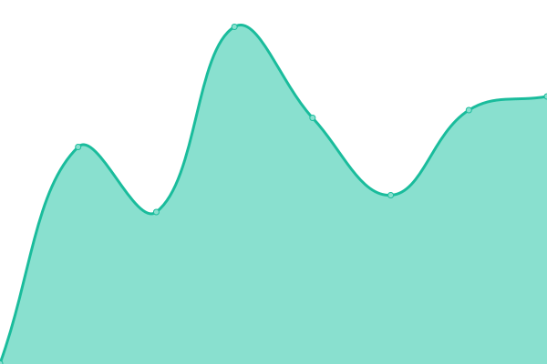

# [📈 Live Status](https://status.lead4car.de): <!--live status--> **🟩 All systems operational**

This repository contains the open-source uptime monitor and status page for [LEAD4CAR](https://lead4car.de), powered by [Upptime](https://github.com/upptime/upptime).

With [Upptime](https://upptime.js.org), you can get your own unlimited and free uptime monitor and status page, powered entirely by a GitHub repository. We use [Issues](https://github.com/LEAD4CAR/status/issues) as incident reports, [Actions](https://github.com/LEAD4CAR/status/actions) as uptime monitors, and [Pages](https://status.lead4car.de) for the status page.

<!--start: status pages-->
<!-- This summary is generated by Upptime (https://github.com/upptime/upptime) -->
<!-- Do not edit this manually, your changes will be overwritten -->
<!-- prettier-ignore -->
| URL | Status | History | Response Time | Uptime |
| --- | ------ | ------- | ------------- | ------ |
|  [Portal PRD](https://portal.lead4car.de/) | 🟩 Up | [portal-prd.yml](https://github.com/LEAD4CAR/status/commits/HEAD/history/portal-prd.yml) | 

 582ms
     
 | 

<a href="https://status.lead4car.de/history/portal-prd">99.73%</a>
    

|  [Portal UAT](https://uat.lead4car.de/) | 🟩 Up | [portal-uat.yml](https://github.com/LEAD4CAR/status/commits/HEAD/history/portal-uat.yml) | 

 616ms
     
 | 

<a href="https://status.lead4car.de/history/portal-uat">99.73%</a>
    

|  [Portal DEV](https://dev.lead4car.de/) | 🟩 Up | [portal-dev.yml](https://github.com/LEAD4CAR/status/commits/HEAD/history/portal-dev.yml) | 

 551ms
     
 | 

<a href="https://status.lead4car.de/history/portal-dev">99.53%</a>
    

|  [Portal DEMO](https://demo.lead4car.de/) | 🟩 Up | [portal-demo.yml](https://github.com/LEAD4CAR/status/commits/HEAD/history/portal-demo.yml) | 

 577ms
     
 | 

<a href="https://status.lead4car.de/history/portal-demo">98.75%</a>
    

|  [Admin PRD](https://admin.lead4car.de/) | 🟩 Up | [admin-prd.yml](https://github.com/LEAD4CAR/status/commits/HEAD/history/admin-prd.yml) | 

 516ms
     
 | 

<a href="https://status.lead4car.de/history/admin-prd">99.73%</a>
    

|  [Admin UAT](https://admin-uat.lead4car.de/) | 🟩 Up | [admin-uat.yml](https://github.com/LEAD4CAR/status/commits/HEAD/history/admin-uat.yml) | 

 571ms
     
 | 

<a href="https://status.lead4car.de/history/admin-uat">99.73%</a>
    

|  [Admin DEV](https://admin-dev.lead4car.de/) | 🟩 Up | [admin-dev.yml](https://github.com/LEAD4CAR/status/commits/HEAD/history/admin-dev.yml) | 

 520ms
     
 | 

<a href="https://status.lead4car.de/history/admin-dev">99.73%</a>
    

|  [Admin DEMO](https://admin-demo.lead4car.de/) | 🟩 Up | [admin-demo.yml](https://github.com/LEAD4CAR/status/commits/HEAD/history/admin-demo.yml) | 

 500ms
     
 | 

<a href="https://status.lead4car.de/history/admin-demo">99.73%</a>
    

<!--end: status pages-->

[**Visit our status website →**](https://status.lead4car.de)

## 📄 License

- Powered by: [Upptime](https://github.com/upptime/upptime)
- Code: [MIT](./LICENSE) © [LEAD4CAR](https://lead4car.de)
- Data in the `./history` directory: [Open Database License](https://opendatacommons.org/licenses/odbl/1-0/)
